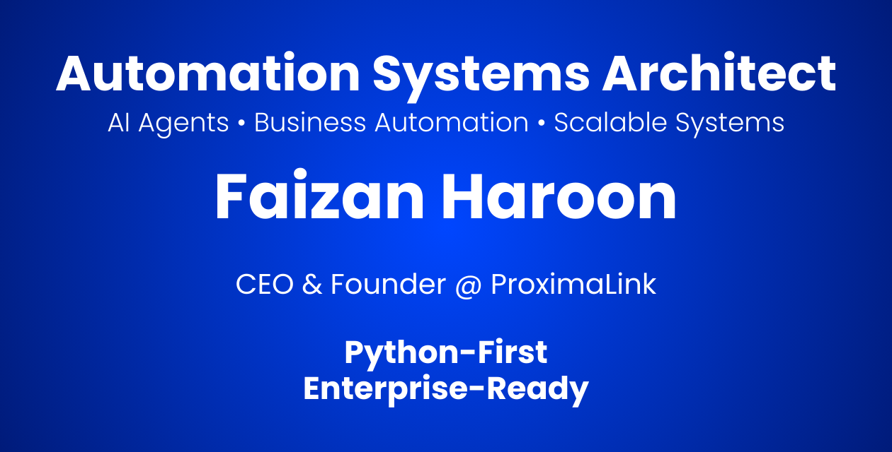

  

<h1 align="center">Hi 👋, I'm Faizan Haroon</h1>
<h3 align="center">CEO & Founder @ ProximaLink | Automation Systems Architect</h3>

  I design and deliver <b>production-ready automation systems</b> that replace manual work and scale with business growth. Unlike one-off scripts, I build robust <b>Python-first architectures</b> focusing on reliability, observability, and long-term value.

 
   

---

### 🚀 What I Do
- 🔭 I’m currently building **Intelligent AI Agents & Enterprise Automation Pipelines.**
- 🤝 I’m looking to collaborate on **System Architecture & High-Scale Python Backends.**
- 💼 Founder of **ProximaLink** - Helping businesses automate workflows.
- 💬 Ask me about **Python, System Design, Web Scraping, and AI Integration.**

---

### 🛠️ Tech Stack & Tools

<h4 align="left">Backend & Automation:</h4>

 
   
   
   
   

<h4 align="left">Data Engineering & AI:</h4>

 
   
   
   
   

<h4 align="left">Cloud & Infrastructure:</h4>

 
   
   
   
   

---

  <h3>GitHub Activity</h3>
  
   
  

 

  <h3>Let's Connect</h3>
  
 
  
  

